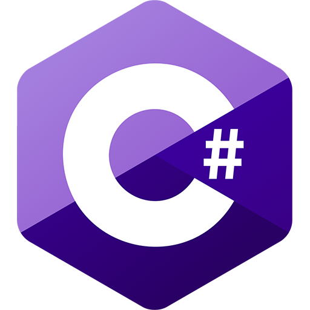
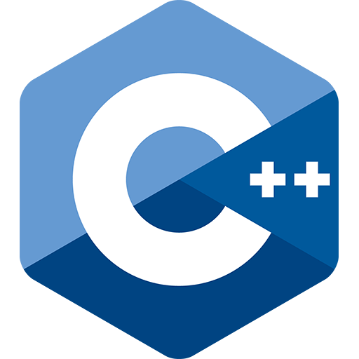

<h1 align="center">Hi there 👋</h1>

	I'm a junior from China, majoring in Computer Science and Technology. Used
	to participate in National Olympaid in Informatics in high school and gained
	first prize.

<h3 align="center">Languages</h3>

	
	
	
	
	
	
	

	
	
	
	
	
	

<h3 align="center">Frontend</h3>

	
	
	

<h3 align="center">Backend</h3>

	
	

<h3 align="center">Databases</h3>

	
	
	

<h3 align="center">IDEs</h3>

	
	
	
	

<h3 align="center">Tools</h3>

	
	
	
	

<h3 align="center">Hardware</h3>

	
	
	
	

 

	

